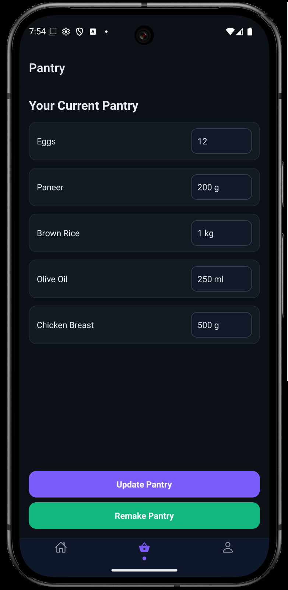

# Kedo - AI-Powered Nutrition Assistant

Kedo is a comprehensive nutrition and meal planning application that combines React Native mobile app with a FastAPI backend powered by Google Gemini AI. The app provides personalized meal recommendations, macro tracking, pantry management, and intelligent nutrition guidance.

## Project Overview

Kedo helps users maintain healthy eating habits through AI-driven meal planning, real-time macro tracking, and smart pantry management. The application features a modern dark-themed UI with smooth animations and intuitive navigation.

## Key Features

### AI-Powered Meal Recommendations
- Personalized meal suggestions based on user profile and dietary preferences
- Real-time meal generation using Google Gemini 2.5 Flash
- Support for breakfast, lunch, dinner, and snack recommendations
- Automatic image generation for meal presentations

### Macro Tracking
- Real-time tracking of protein, carbs, and fat intake
- Visual progress bars with color-coded macro breakdown
- Daily calorie and macro target management
- Custom food logging with AI-powered macro estimation

### Pantry Management
- Smart pantry inventory tracking
- AI-powered pantry reconstruction from text descriptions
- Automatic ingredient deduction when meals are consumed
- Bulk pantry updates and management

### User Profile Management
- Comprehensive user profile with health metrics
- Dietary restrictions and allergy tracking
- Activity level and fitness goal management
- Prescription image upload capability

### Calendar Integration
- Meal scheduling with device calendar integration
- Automatic meal time reminders
- Customizable meal time preferences

## Screenshots

### Home Screen


The home screen displays daily macro progress, meal recommendations, and quick actions for meal management. Users can view detailed recipes, mark meals as consumed, and request alternative suggestions.

### Pantry Screen


The pantry screen allows users to manage their food inventory, update quantities, and rebuild their pantry using AI-powered text analysis.

### Profile Screen


The profile screen enables users to set personal health metrics, dietary preferences, and upload prescription images for personalized recommendations.

## Technology Stack

### Frontend (React Native)
- **React Native 0.79.6** - Cross-platform mobile development
- **Expo SDK 53** - Development platform and tools
- **React Navigation 7** - Navigation and routing
- **React Native Reanimated** - Smooth animations
- **Expo Calendar** - Calendar integration
- **Expo Image Picker** - Image selection and upload

### Backend (FastAPI)
- **FastAPI** - Modern Python web framework
- **Google Gemini 2.5 Flash** - AI-powered meal generation
- **Portia AI** - Human-in-the-loop clarification system
- **Pydantic** - Data validation and serialization
- **APScheduler** - Automated daily meal planning

### APIs and Services
- **Pixabay API** - High-quality food images
- **Unsplash Source** - Fallback image service
- **Google Generative AI** - Advanced language model integration

## Project Structure

```
kedo/
├── kedo-app/                 # React Native mobile application
│   ├── app/                  # Expo app configuration
│   ├── src/
│   │   ├── components/       # Reusable UI components
│   │   ├── screens/          # Main application screens
│   │   ├── config/           # API and feature configuration
│   │   └── lib/              # API client and utilities
│   ├── assets/               # App icons and images
│   └── package.json          # Frontend dependencies
├── server/                   # FastAPI backend server
│   ├── main.py              # Main server application
│   └── env.example          # Environment variables template
└── README.md                # Project documentation
```

## Installation and Setup

### Prerequisites
- Node.js 18+ and npm
- Python 3.8+
- Expo CLI
- Android Studio (for Android development)
- Xcode (for iOS development, macOS only)

### Backend Setup

1. Navigate to the server directory:
```bash
cd server
```

2. Create a virtual environment:
```bash
python -m venv venv
source venv/bin/activate  # On Windows: venv\Scripts\activate
```

3. Install Python dependencies:
```bash
pip install fastapi uvicorn google-generativeai portia python-dotenv requests apscheduler python-multipart
```

4. Create environment file:
```bash
cp env.example .env
```

5. Configure environment variables in `.env`:
```
GEMINI_API_KEY=your_gemini_api_key_here
PIXABAY_KEY=your_pixabay_api_key_here
```

6. Start the backend server:
```bash
uvicorn main:app --reload --port 8000
```

### Frontend Setup

1. Navigate to the mobile app directory:
```bash
cd kedo-app
```

2. Install dependencies:
```bash
npm install
```

3. Configure API endpoints in `src/config/api.js`:
```javascript
export const API_CONFIG = {
  BASE_URL: 'http://10.0.2.2:8000', // Android emulator
  // BASE_URL: 'http://localhost:8000', // iOS simulator
  // BASE_URL: 'http://your-server-ip:8000', // Physical device
};
```

4. Start the development server:
```bash
npm start
```

5. Run on device or emulator:
```bash
# Android
npm run android

# iOS
npm run ios

# Web
npm run web
```

## API Endpoints

### User Management
- `POST /user/profile` - Update user profile
- `GET /user/profile` - Get user profile
- `POST /user/prescription` - Upload prescription image

### Meal Management
- `GET /meals/recommendations` - Get AI meal recommendations
- `GET /meals/suggest_another` - Get alternative meal suggestion
- `GET /meals/recommend_snack` - Get snack recommendation
- `POST /meals/log_eaten` - Log consumed meal
- `POST /meals/log_custom` - Log custom food intake

### Pantry Management
- `GET /pantry` - Get pantry inventory
- `POST /pantry/update` - Update pantry items
- `POST /pantry/remake` - Rebuild pantry from text

### Macro Tracking
- `GET /macros/targets` - Get daily macro targets
- `GET /macros/today` - Get today's macro totals

### Clarifications
- `POST /clarifications/resolve` - Resolve user clarifications

## Configuration

### Feature Flags
The application includes configurable feature flags in `src/config/api.js`:

- `AI_MEAL_RECOMMENDATIONS` - Enable AI-powered meal suggestions
- `MEAL_IMAGES` - Enable automatic meal image generation
- `CALENDAR_INTEGRATION` - Enable calendar integration
- `PORTIA_AI` - Enable Portia AI features
- `ANALYTICS` - Enable advanced analytics

### Environment Variables
Required environment variables for the backend:

- `GEMINI_API_KEY` - Google Gemini API key for AI features
- `PIXABAY_KEY` - Pixabay API key for high-quality images

## Development

### Code Style
- Frontend: ESLint and Prettier for code formatting
- Backend: Black and isort for Python code formatting
- TypeScript support for type safety

### Testing
- Frontend: Jest and React Native Testing Library
- Backend: Pytest for API testing

### Deployment
- Frontend: Expo Application Services (EAS) for app distribution
- Backend: Docker containerization for server deployment

## Contributing

1. Fork the repository
2. Create a feature branch
3. Make your changes
4. Add tests for new functionality
5. Submit a pull request

## License

This project is licensed under the MIT License - see the LICENSE file for details.

## Support

For support and questions:
- Create an issue in the GitHub repository
- Check the documentation in the `/docs` folder
- Review the API documentation at `/docs` when the server is running

## Roadmap

- [ ] Advanced meal planning with weekly schedules
- [ ] Social features and meal sharing
- [ ] Integration with fitness tracking apps
- [ ] Barcode scanning for food items
- [ ] Voice commands for hands-free operation
- [ ] Offline mode with local data storage
- [ ] Multi-language support
- [ ] Dark/light theme toggle
